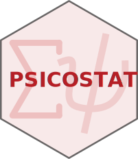

# Website Template for Psicostat

This repository contains the website template created for members of [Psicostat](https://psicostat-template.netlify.com/). The idea is to simplify and adapt the awesome [Academic](https://sourcethemes.com/academic/) theme for [Hugo](https://gohugo.io/). There are some graphical and structural customization in particular for making the website clean and simple. The main goal is to have a personal website for academic needs but other sections and functions can be easily added.

## The repository

In the `master branch` there is the website structure with all files. In the `gh-pages branch` there is a simple documentation with information and commands for managing the website.

## Links

* The **base website** is already deployed online at this link [psicostat-template.netlify.com](https://psicostat-template.netlify.com)
* The **documentation** is available at this link [psicostat_template](https://filippogambarota.github.io/psicostat_template/)
* Some information about getting started with Hugo and the Academic is available on this repository [filippogambarota/hugo_tutorial](https://github.com/filippogambarota/hugo_tutorial).