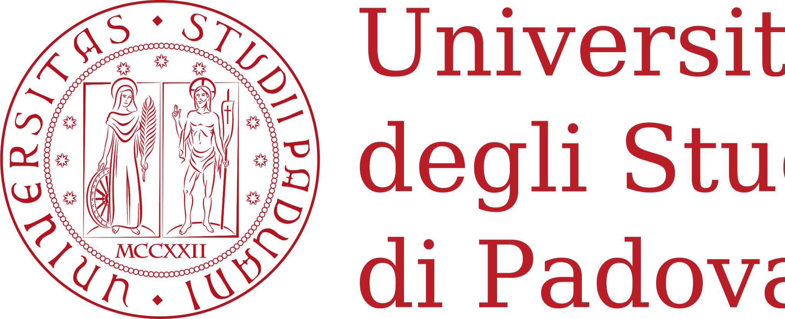

+++
# Questa è una pagina che presenta il gruppo psicostat. C'è un feed di twitter, un po' di descrizione e il nostro motto

widget = "blank"  # See https://sourcethemes.com/academic/docs/page-builder/
headless = true  # This file represents a page section.
active = true  # Activate this widget? true/false
weight = 1  # Order that this section will appear.

title = "Psicostat"
subtitle = ""

[design]
  # Choose how many columns the section has. Valid values: 1 or 2.
  columns = "2"

[design.background]
  # Apply a background color, gradient, or image.
  #   Uncomment (by removing `#`) an option to apply it.
  #   Choose a light or dark text color by setting `text_color_light`.
  #   Any HTML color name or Hex value is valid.

  # Background color.
  # color = "navy"
  
  # Background gradient.
  # gradient_start = "DeepSkyBlue"
  # gradient_end = "SkyBlue"
  
  # Background image.
  #image = "headers/bubbles-wide.jpg"  # Name of image in `static/img/`.
  image_darken = 0.6  # Darken the image? Range 0-1 where 0 is transparent and 1 is opaque.
  image_size = "cover"  #  Options are `cover` (default), `contain`, or `actual` size.
  image_position = "center"  # Options include `left`, `center` (default), or `right`.
  image_parallax = true  # Use a fun parallax-like fixed background effect? true/false

  # Text color (true=light or false=dark).
  text_color_light = false

[design.spacing]
  # Customize the section spacing. Order is top, right, bottom, left.
  padding = ["20px", "0", "20px", "0"]

[advanced]
 # Custom CSS. 
 css_style = ""
 
 # CSS class.
 css_class = ""
+++

## About

We are an interdisciplinary research group interested in **Psychology** and **Statistics**, working in areas related to ***quantitative psychology***, ***psychometrics***, ***psychological testing*** and ***statistics***.

Our goal is to promote the connection between the two fields in order ti benefit the progress of scientific research. We are located in the [Department of Developmental Psychology and Socialisation](https://www.dpss.unipd.it/en/) at [University of Padua](https://www.unipd.it/en/)