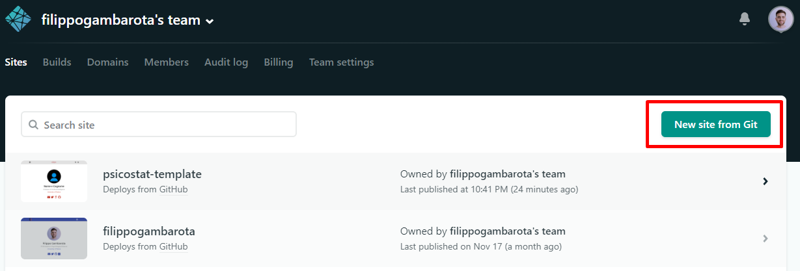

- [How to create the website?](#how-to-create-the-website)
  - [What do we need?](#what-do-we-need)
- [Step by Step Guide](#step-by-step-guide)
  - [1. One-click installer](#1-one-click-installer)
  - [2. Forking and Connecting with Netlify](#2-forking-and-connecting-with-netlify)
    - [1. Forking the repository](#1-forking-the-repository)
      - [Customize la repository](#customize-la-repository)
    - [2. Cloning locally](#2-cloning-locally)
  - [2. Deploying the website](#2-deploying-the-website)
- [How to manage the website?](#how-to-manage-the-website)
  - [Website Structure](#website-structure)
  - [First modifications](#first-modifications)
  - [Home](#home)
  - [New contents](#new-contents)
    - [How to create a new content?](#how-to-create-a-new-content)
      - [Link to other files](#link-to-other-files)
    - [Save and upload all modifications](#save-and-upload-all-modifications)
      - [Commit](#commit)

# How to create the website?

Nella mia [breve introduzione](https://github.com/filippogambarota/hugo_tutorial) ad Hugo avevo suggerito di utilizzare **blogdown** e quindi RStudio per creare da zero il sito. Tuttavia essendo che partiremo da un **template modificato** utilizzeremo un approccio leggermente diverso.
Questo template è un semplice adattamento del tema **Academic** con alcune modifiche estetiche e di struttura:

* Sezioni per post, talk, poster, progetti
* Una sezione specifica per Psicostat con link al sito web, feed di Twitter aggiornato e non per ultimo il nostro motto :smile:.
* Il logo nella schermata principale e anche le icone che compaiono nelle tabs del browser

Inoltre molte funzioni e link sono stati rimossi (o meglio semplicemente disattivati) per semplificare l'interfaccia ed il funzionamento. Tuttavia il bello di questo framework è la totale personalizzazione, pur partendo però da un template semplice.

## What do we need?

* [GIT](https://git-scm.com/) and [Hugo](https://gohugo.io/) installed on the PC
* A [Github](https://github.com/) account
* A [Netlify](https://www.netlify.com/) account
* RStudio con il pacchetto Blogdown oppure un'altra IDE ([VSCode](https://code.visualstudio.com/) super raccomandato). VSCode è veramente un super software con un sacco di plugin per HTML, Markdown e CSS (oltre anche ad R e Python). L'integrazione con GIT e Github è molto più rapida ed efficiente di RStudio. La modalità più efficiente di usare GIT e Github rimane l'utilizzo del terminale e questo ovviamente è possibile sia con RStudio che con VSCode.

# Step by Step Guide

Ci sono due modalità per creare il proprio sito partendo dal template creato:

1. One-click installer (facile e automatica)
2. Copiare la repository e connetterla con Netlify (qualche passaggio in più)

## 1. One-click installer

Sostanzialmente cliccando su [questo link](https://app.netlify.com/start/deploy?repository=https://github.com/filippogambarota/psicostat_template) Netlify crea automaticamente un sito basato sulla repository `filippogambarota/psicostat_template`. Quindi è sufficiente avere un account Netlify fare il login e seguire gli step del link. A questo punto è sufficiente [clonare la repository localmente](#2-cloning-locally) e passare direttamente al paragrafo su come [gestire il sito](#how-to-manage-the-website).

## 2. Forking and Connecting with Netlify

### 1. Forking the repository

La prima cosa da fare è copiare la repository sul proprio account Github. Quando sei loggato a Github vai su questa repository [psicostat_template](https://github.com/filippogambarota/psicostat_template) e premi il pulsante `fork` in alto a destra. In questo modo avrai una copia esatta del template sul tuo account personale.

#### Customize la repository

E' possibile anche rinominare la tua repository in modo da avere `username/repository_name`. Un consiglio è anche quello di mettere la repository come **privata** perchè potrebbe essere che dovrai mettere alcuni dati sensibili online. Credo sia possibile gestire in modo avanzato quali file sincronizzare online e quali no ma potrebbe anche corrompere in qualche modo la struttura del sito.

### 2. Cloning locally

Ora dobbiamo fare una copia locale del sito che sara gestita tramite GIT e già collegata a Github così tutte le modifiche saranno automaticamente caricate su Github. Per clonare localmente la repository è sufficiente aprire il terminale (`cmd` o `powershell` su Windows), navigare sulla cartella in cui si vuole copiare il sito e digitare:

```git
git clone https://github.com/filippogambarota/psicostat_template.git
```

Ora tutte le cartelle e i file saranno copiati sul PC e sarà possibile modificare e fare l'upload delle modifiche. Per verificare che il sito funzioni correttamente è sufficiente aprire nuovamente il terminale nella **root** del sito e digitare:

```
hugo server
```

Questo comando serve a costruire il sito e verificare che non ci siano errori o file corrotti. Se tutto va bene vi darà un messaggio di conferma assieme ad un'indirizzo locale da copiare e incollare nel browser per visualizzare una copia offline del sito. Questo comando sarà inoltre utile perchè si aggiorna in tempo reale a seconda delle modifiche al sito in modo da vedere subito il risultato.

## 2. Deploying the website

L'ultimo passo per avere il sito correttamente online è quello di connettere la nostra repository su Github al nostro account Netlify. Netlify è un servizio di hosting gratuito (fino ad un certo traffico e con funzioni base) perfettamente integrato con Hugo e il tema Academic. Per connettere la nostra repository semplicemente cliccare (in figura) `new site from Git`.



E' necessario poi seguire tutti gli step e dare la conferma. Ci sono dei parametri da inserire ma nella cartella del nostro sito (e quindi nella repository di Github) è presente un file `netlify.toml` che contiene tutti i parametri che vengono automaticamente letti da Netlify. Se tutto funziona correttamente dovrebbe comparire un messaggio di conferma riguardo al sito e a questo punto è possibile cambiare il nome del dominio mantendento però `nomesito.netlify.com`. Entrando su `domain settings` è possibile cambiare diverse impostazioni del sito.

# How to manage the website?

La documentazione di Hugo e del tema Academic sono veramente ottime e complete tuttavia essendo personalmente ad un livello molto base le ho trovate leggermente complesse e dispersive. In questo caso quindi vorrei riportare quelle informazioni essenziali rispetto alla struttura, i comandi e le funzioni per gestire quotidinamente. Se queste informazioni non dovessero essere abbastanza è sufficiente consultare la documentazione ufficiale e anche la repository Github del tema Academic per aspetti più avanzati.
Tuttavia un aspetto veramente fantastico del tema riguarda il fatto che tutte le pagine, i template e i file interni sono documentati in modo esaustivo all'interno del file stesso in modo da sapere sempre cosa modificare per avere un determinato risultato.

## Website Structure

La cartella principale del sito contiene:
* Il file `.Rproj` che permette di aprire e gestire il sito con RStudio essendo che è stato creato inizialmente con il pacchetto **blogdown**.
* Il file `config.toml` che contiene la configurazione di base del sito.
* Il file `netlify.toml` che contiene i settaggi per il deploying online
* La cartella `public` che sarebbe la versione compilata del sito che viene mandata online (in altri termini le pagine scritte in Markdown o RMarkdown vengono compilate in HTML e inserite nella cartella per la visualizzazione da browser)
* La cartella `content` che contiene tutte i file e le immagini del sito. Questa cartella sarà quella che maggiormente verrà modificata.
* La cartella `data` che ho creato per contenere i file `.toml` del tema modificato. In pratica modificando i parametri dentro questa cartella il tema (colori, fonts) verra cambiato all'intero sito.
* La cartella `config` che contiene altri file di configurazione di base (simili a `config.toml`) del sito come la **lingua**, tutte le **informazioni di contatto**, le eventuali **mappe** da visualizzare, i **link ai social network** e sopratutto la **struttura del menu home**.

## First modifications

Prima di illustrare come gestire nuovi contenuti bisogna modificare le impostazioni di base del sito in modo da renderlo subito personalizzato. Come detto in precedenza, prima di fare queste modifiche lanciare il comando `hugo server` in modo da vedere tutte le modifiche in tempo reale. I primi step da fare sono quindi:

1. Aprire i vari file di configurazione `.toml` e cambiare le impostazioni desiderate come contatti, link e nome del sito. Il logo e in generale tutte le immagini sono contenute nella cartella `static/img` quindi è sufficiente cambiare l'immagine e inserire il nome nei file di configurazione per cambiare anche il logo. Se non è necessario per il momento non cambiare la struttura della home nel file `menus.toml`.
2. Prima dei contenuti veri e propri è utile aggiornare il proprio profilo come autore. Essendo che il sito supporta diversi autori con diversi profili se si modifica l'autore principale (`admin`) ogni volta che in un post o pubblicazione inseriamo `admin` come autore automaticamente si farà riferimento a quel profilo con le informazioni associate. Per modificare il profilo autore andare su `content/authors/admin/_index.md`. Ci sono varie informazioni da inserire come i link social con le icone.
3. E' inoltre possibile inserire l'immagine del profilo che appare nella pagina personale sostituendo e rinominando la foto come `avatar.jpg`.

## Home

A questo punto le informazioni di base nostre e del sito sono inserite. Il prossimo passo è capire il funzionamento della schermata home. Nella cartella `content/home` sono contenute le varie pagine `.md` con le informazioni che appaiono nella schermata home. Le varie pagine sono create su dei `widget` base che fanno parte del tema e che sono il punto di partenza per creare delle sezioni personalizzate. Ad esempio la sezione **Psicostat** non è altro che un `widget blank` ([link alla documentazione per informazioni sui widget](https://sourcethemes.com/academic/docs/page-builder/)) dove sono stati inseriti il feed di twitter, un'immagine e un titolo. I vari widget hanno delle caratteristiche di struttura, aspetto e funzionalità. Ad esempio la pagina `Skill` è basata sul widget `featurette` che permette di creare quelle icone a blocchi che indicano le nostre skills in modo grafico. All'interno delle pagine nella cartella home ci sono dei comandi di configurazione racchiusi tra `+++` (concettualmente è identico al codice YALM racchiuso tra `---`prima di un documento in KNITR) e il testo che viene scritto direttamente in Markdown ma anche in HTML (per alcune feature avanzate). Ogni funzione di configurazione è documentata con dei commenti dell'autore.

Un'aspetto importante è il parametro `weight =` che indica l'ordine di visualizzazione nella pagina. Diverse invece sono le sezioni in alto nella home. Sostanzialmente possiamo creare una nuova sezione della home, come **Psicostat** e collegarla ad un widget nella pagina principale. Nel file `config/_default/menus.toml` abbiamo le sezioni che vengono visualizzate in alto dove `name` indica il nome da visualizzare e `#nome` indica il nome del file `.md` all'interno della cartella `content/home`. In questo modo quando viene premuto il collegamento in alto, il sito indirizza alla sezione corrispondente.
Ovviamente è possibile creare una sezione con un link esterno (un sito web) oppure, come indicato in fondo al file `menus.toml` ad un CV in formato pdf.

## New contents

Ora il sito è strutturato e organizzato. Per creare nuovi contenuti ci sono varie modalità e quindi vi presento la modalità che mi sembra più semplice ed efficace. All'interno della cartella `content` abbiamo tutti i vari tipi di contenuti disponibili. Il sito di base fornisce degli esempi che oltre a far capire cosa e come scrivere il contenuto vero e proprio fa vedere anche come organizzare le cartelle. Ad esempio la cartella `content/publication` contiene le varie pubblicazioni (una per cartella) che verranno poi visualizzate nella sezione **Publications** che abbiamo visto prima nella cartella `content/home`. Il file `index.md` contiene alcuni elementi tipici del template per le pubblicazioni già presente nel tema. Anche qui ci sono delle info di base contenute in linguaggio YAML `---` con inoltre dei link da mettere per altro materiale come poster, database, repository e così via.

### How to create a new content?

Per creare un nuovo contenuto sarebbe semplicemente necessario creare un nuovo file Markdown con l'intestazione uguale a quella di un articolo già presente e poi inserire le informazioni. Un modo più semplice però consiste nell'utilizzare le funzioni di Hugo per creare dei contenuti.
Se apriamo il terminale nella root del nostro sito e digitiamo:

```
hugo new --kind #tipo_template cartella/nome_file
```

Automaticamente si crea una cartella nel percorso selezionato con un file Markdown strutturato secondo il template indicato. Se vogliamo ad esempio creare una nuova pubblicazione possiamo digitare:

```
hugo new --kind publication publication/nome_pubblicazione
```
Questo vale per tutte le tipologie di contenuti come talk, projects e post. In questo modo sarà necessario semplicemente aprire il file creato e modificare senza preoccuparsi della struttura o di informazioni mancanti.

#### Link to other files

Nei vari contenuti che scriviamo o a cui vogliamo collegarci con un link c'è la possibilità di inserire dei file che risiedono effettivamente nel sito come immagini, i full-text degli articoli o altro materiale. Ad esempio se nell'articolo vogliamo inserire un link al pdf (`url_pdf =`)possiamo mettere un link web per esempio al full-text della rivista o al sito stesso del database oppure creare un link ad un file che effettivamente è memorizzato nel sito. Tutti i file sono contenuti nella cartella `static` e possono essere organizzati in qualunque modo. L'importante è **inserire la path al file senza la cartella static** e quindi per esempio se abbiamo un pdf nella cartella static semplicemente inserire il link come `nome.pdf`. Nel caso fosse in sottocartelle inserire `folder/nome.pdf`. lo stesso funziona per inserire delle immagini in un post o in qualunque altra parte del sito.

### Save and upload all modifications

Questo è sicuramente lo step più importante. Tutte le modifiche che sono state fatte fino ad ora saranno state sicuramente visualizzate nella version locale del sito (con il comando `hugo server`). Per salvare una modifica è sufficiente semplicemente salvare il file dove questa è stata fatta. Se il sito viene compilato senza errori significa che anche la versione online non avrà problemi.

Tutte le modifiche locali però devono passare per altri 2 importanti step per essere effettivamente online:

1. Deve essere effettuato un `commit` tramite GIT (quindi in locale) con un messaggio di commit sensato in modo da rendere più facile tornare indietro per eventuali errori.
2. Effettuare il `push` delle modifiche alla repository Github (quindi online). A questo punto Netlify rileverà le modifiche e il sito sarà aggiornato in qualche minuto.

#### Commit

Per effettuare il commit si possono utilizzare i tool del software che utilizziamo oppure direttamente da terminale. I comandi principali sono:

```git
git add . #per aggiungere tutte le modifiche al commit
git commit -m "Message" #commit con messaggio
git push #mandare tutte le modifiche a Github
```