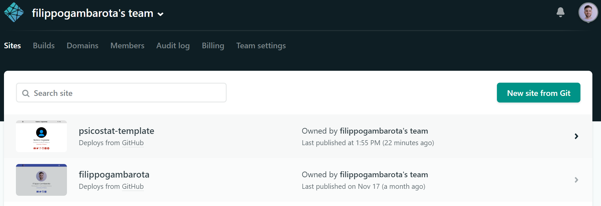
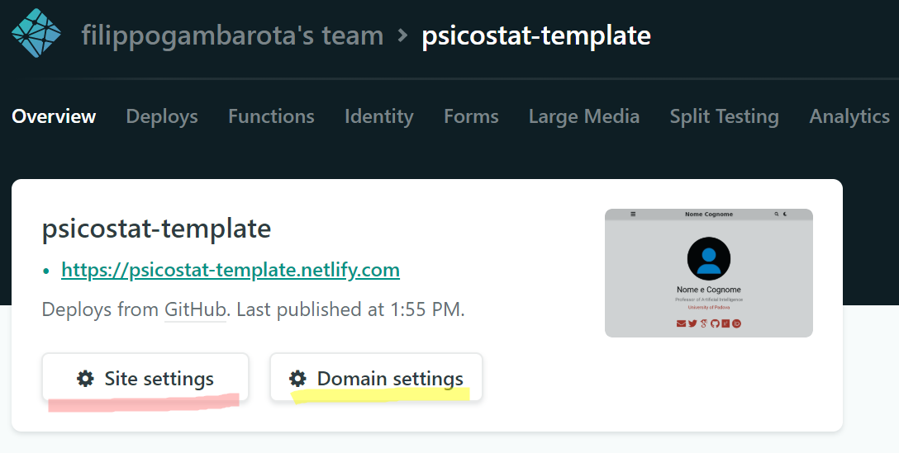
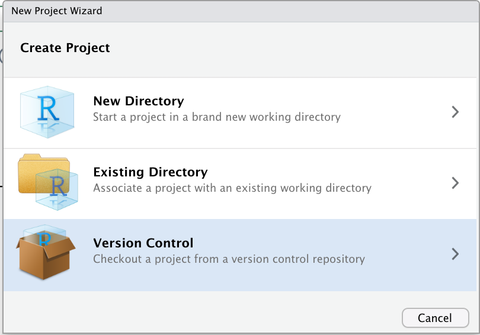
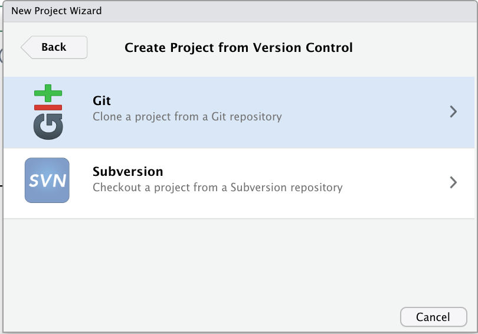
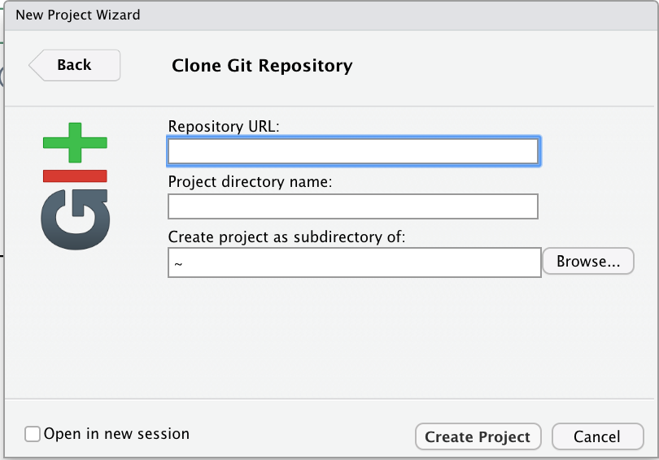
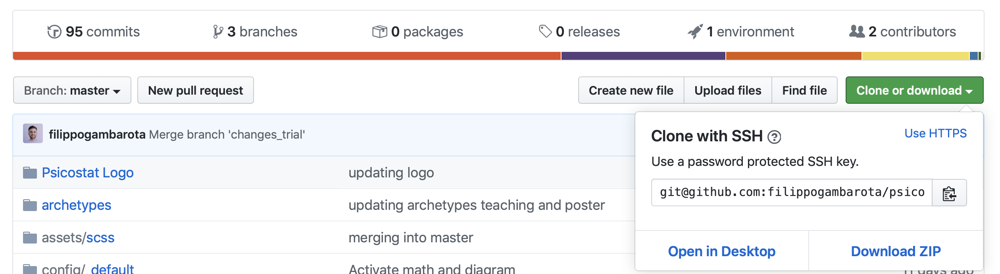
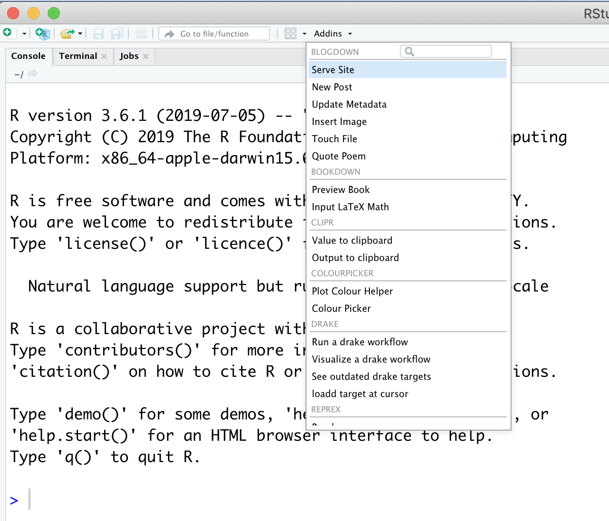

- [Get ready with Psicostat Template](#get-ready-with-psicostat-template)
  - [What do we need?](#what-do-we-need)
- [Installing Psicostat Template](#installing-psicostat-template)
  - [One-click installer](#one-click-installer)
  - [Cloning locally](#cloning-locally)
  - [Compile the website](#compile-the-website)
- [How to manage the website](#how-to-manage-the-website)
  - [Website structure](#website-structure)
  - [Settings and personal information](#settings-and-personal-information)
  - [Home](#home)
  - [Contents folders](#contents-folders)
  - [Contents types](#contents-types)
  - [How to create a new content?](#how-to-create-a-new-content)
      - [Available templates](#available-templates)
      - [Link to other files](#link-to-other-files)
- [Save and upload all modifications](#save-and-upload-all-modifications)
- [Useful Links](#useful-links)

# Get ready with Psicostat Template

Psicostat template permette di creare un proprio sito personale che abbia un tema comune per tutti i membri del gruppo [Psicostat](http://ip146179.psy.unipd.it/psicostat/web/). Questo template si basa su un adattamento del tema [Academic](https://sourcethemes.com/academic/), basato su Hugo, con alcune modifiche estetiche e di struttura:

* Sezioni per post, talk, poster e insegnamenti
* Una sezione specifica per Psicostat con link al sito web, feed di Twitter aggiornato e non per ultimo il nostro motto.

Inoltre molte funzioni e link sono stati rimossi (o meglio semplicemente disattivati) per semplificare l'interfaccia ed il funzionamento. Tuttavia il bello di questo framework è la totale personalizzazione, pur partendo però da un template semplice.

## What do we need?

Per installare Psicostat template è necessario avere

* [GIT](https://git-scm.com/) e [Hugo](https://gohugo.io/) installati sul PC
* Un account [Github](https://github.com/).
* Un account [Netlify](https://www.netlify.com/).
* RStudio con il pacchetto Blogdown oppure un'altra IDE ([VSCode](https://code.visualstudio.com/) super raccomandato). 

Nel caso vogliate usare RStudio assicuratevi di aver correttamente attivato GIT in RStudio. In caso contrario, seguite le indicazioni contenute nella [documentazione ufficiale](https://support.rstudio.com/hc/en-us/articles/200532077?version=1.3.322&mode=desktop) e per ulteriori informazioni riguardanti l'utilizzo di GIT da RStudio suggerisco il [presente link](http://r-pkgs.had.co.nz/git.html). Inoltre è consigliato installare il pacchetto **blogdown** (`install.packages("blogdown")`).

In alternativa, [VSCode](https://code.visualstudio.com/) è veramente un super software con un sacco di plugin per HTML, Markdown e CSS (oltre anche ad R e Python). L'integrazione con GIT e Github è molto più rapida ed efficiente di RStudio. 

Tuttavia, la modalità più efficiente di usare GIT e Github rimane l'utilizzo del terminale e questo ovviamente è possibile sia con RStudio che con VSCode.

# Installing Psicostat Template

Nella mia [breve introduzione](https://github.com/filippogambarota/hugo_tutorial) ad Hugo avevo suggerito di utilizzare **blogdown** e quindi RStudio per creare da zero il sito. Tuttavia, essendo che partiremo da un template modificato, utilizzeremo un approccio leggermente diverso. 

## One-click installer

Una volta creato l'account Github e Netlify, il modo più semplice e veloce per creare il sito e collegarlo direttamente a Netlify è andare su [questo link](https://app.netlify.com/start/deploy?repository=https://github.com/filippogambarota/psicostat_template). 

In questo modo si crea automaticamente una repository (copiando il template `filippogambarota/psicostat_template`) sul proprio account Github che si connette direttamente su Netlify. In fase di creazione si potrà rinominare la repository e successivamente anche il dominio del sito dal pannello di controllo di Netlify.

All'interno della repository c'è un file `netlify.toml` che contiene tutti i settaggi che Netlify userà per i deploying. Di conseguenza non dovrebbe essere necessario modificare nessuna impostazione. Nella `fig.1` è si vede il pannello di controllo con il sito creato (se il nome non è stato modificato il sito avrà un nome strano autogenerato). Cliccando sul sito si accede (fig.2) al pannello di controllo dove modificare le impostazioni (non consigliato) e il dominio (`domain settings`).


<div class="row text-center"></div>

<div class="row text-center"></div>

## Cloning locally

A questo punto è possibile modificare i file direttamente da Github per aggiornare il sito. Tuttavia, l'interfaccia di Github è molto scomoda. Per gestire il sito, è quindi preferibile utilizzare RStudio o VSCode che permettono di modificare i file localmente e poi fare il `push` delle modifiche a Github.

In RStudio, per copiare la repository localmente, è necessario creare un nuovo Project (`File`->`New Project`) selezionando l'opzione `Version Control` e come sistema GIT. Successivamente è necessario indicare l'URL della Repository, il nome della cartella del Project (di default viene usato lo stesso nome della repository) e dove si vuole creare il Project.

<div class="row text-center">



</div>

Per ottenere l'URL della repository, dalla pagina di Github premete il tasto verde `Clone or download` e copiate l'indirizzo. Una volta creato il progetto tutti la repository verrà automaticamente clonata localmente.

<div class="row text-center"></div>

In alternativa utilizzando il terminale, è sufficiente posizionarsi nella cartella dove si vuole mantenere il sito e utilizzare il seguente comando (mettendo il proprio `#nomeutente` e `#nomerepository`):

```git
git clone https://github.com/#nomeutente/#nomerepository.git
```

## Compile the website

Prima di cominciare a modificare il sito, ci sono diversi modi per capire se la procedura finora è andata a buon fine:

* Se il sito è online all'indirizzo di Netlify
* Da Rstudio premere il comando `Addins -> Serve Site` per creare e visualizzare automaticamente il sito.
<div class="row text-center">  </div>

* Da terminale, dopo aver clonato la repository localmente, posizionarsi nella `root` della cartella e utilizzare il seguente comando che permette di compilare il sito e fornisce un indirizzo locale per vedere il funzionamento.:
``` terminal
hugo server
```

Il fatto che il sito sia compilato senza errori e venga visualizzato significa che non ci sono problemi nella struttura.

# How to manage the website

<span style="color:RED">Nota importante su Blogdown e Hugo</span>:
> La gestione del sito può essere eseguita da qualunque editor di testo. **Blogdown** è un ottimo pacchetto che sostanzialmente fornisce una struttura semplificata (anche con addins grafici), con apposite funzioni sviluppate in R, al codice di Hugo. Tuttavia, per la [creazione di nuovo contenuto](#how-to-create-a-new-content) le funzioni di Hugo sono da preferire sia per comodità e anche perchè l'aver modificato l'archetipo rende più instabile l'interfaccia grafica che fornisce Blogdown. Allo stesso modo la funzione `serve Site` e `hugo server` sono analoghe e la scelta è assolutamente in base alla preferenza personale.
> L'unica differenza reale tra RStudio e VSCode (o altri programmi) è la capacità di gestire file `RMarkdown` integrando quindi anche chunk di codice da compilare. VSCode dall'altra fornisce numerosi plugin avanzati per gestire tutti i file con suggerimento di codice, segnalazione di errori di sintassi per tutti i file importanti del sito (`.toml`, `.html`, `.css`, `.yaml`, etc.)

La documentazione di [Hugo](https://gohugo.io/documentation/) e del [tema Academic](https://sourcethemes.com/academic/docs/) sono veramente ottime e complete. Tuttavia, inizialmente la  struttura del sito risulta coplessa poichè vengono utilizzati molti file con diversi linguaggi (GO, TOML, HTML, CSS e Markdown).

Di seguito vengono quindi riportate le informazioni essenziali rispetto alla struttura, i comandi e le funzioni per inserire i propri dati e gestire quotidinamente il sito. Per chi fosse interessato ad approfondire questi aspetti oppure personalizzare ulteriormente il template, ulteriori link sono indicati nella documentazione e le principali risorse sono elencate nella [sezione finale](#useful-links).

Prima di iniziare a modificare il sito web è buona norma compilare il sito con il comando `Serve Site` di Rstudio o da terminale eseguire `hugo server` (vedi sezione [Compile the website](#compile-the-website)). Questo, oltre a controllare la struttura, permette di avere un indirizzo locale dove tutte le modifiche vengono visualizzate in tempo reale. Così una volta soddisfatti possiamo effettuare il **commit** ed il **push** attraverso GIT.

## Website structure

All'interno della repository troviamo diverse cartelle e relativi file che permettono di creare il proprio sito. I file e cartelle di interesse che permettono di inserire i propri dati e contenuti nel sito sono:

* Il file `.Rproj` che permette di aprire e gestire il sito con RStudio essendo che è stato creato inizialmente con il pacchetto **blogdown**.
* Il file `config.toml` che contiene la configurazione di base del sito.
* Il file `netlify.toml` che contiene i settaggi per il deploying online.
* La cartella `config` che contiene altri file di configurazione di base (simili a `config.toml`) del sito come la **lingua**, tutte le **informazioni di contatto**, le eventuali **mappe** da visualizzare, i **link ai social network** e sopratutto la **struttura del menu home**.
* La cartella `data` che contiene i file `.toml` del tema modificato,che determinano colori e  fonts dell'intero sito.
* La cartella `content` che contiene tutti i file e le immagini delle varie sezioni del sito del sito (projects, posts, talks, posters etc.). Questa cartella sarà quella che maggiormente verrà modificata.
* La cartella `static` che contiene ulteriori file e materiale che vogliamo visualizzare nel sito (ad esempio il proprio **CV**).

All'interno della cartella principale ci sono altri file e cartelle che contengono tutte le informazioni riguardanti la struttura ed il funzionamento del sito. In particolare abbiamo:

* La cartella `public` che contiene la versione compilata del sito che viene mandata online (in altri termini le pagine scritte in Markdown o RMarkdown vengono compilate in HTML e inserite nella cartella per la visualizzazione da browser). Questa cartella viene creata in automatico quando si compila il sito e non va modificata.
* la cartella `theme`  che contiene la struttura di default del tema Academic. Questa cartella non va assolutamente modificata.
* Le restanti cartelle (`archetypes`, `assets`, `i18n` e `layouts`) che contengono i file utilizzati per definire i cambiamenti del template psicostat rispetto al tema Academic. Anche questi file non andrebbero modificati a meno che non si voglia modificare e personalizzare la struttura o il funzionamento del sito.

Tutti i file riportano numerosi commenti per chiarire quali sono le varie funzioni. E' consigliato non cancellare nessun commento e rispettare la stuttura degli esempi presentati. Inoltre, nel caso in cui non si voglia includere una parte, è preferibile commentarla invece che eliminarla per renderla facilmente disponibile in un secondo momento.

## Settings and personal information

I file da modificare riguardanti le impostazioni del sito e le informazioni personali sono:

1. `config.toml`. Si devono inserire il proprio nome e cognome sia nel campo `title` che nel campo `copyright`. Le altre opzioni non vanno cambiate.
2. `content/authors/admin/_index.md`. Qui vanno inserite le informazioni del proprio profilo che sono visualizzate nella homepage. Dato che il sito supporta diversi autori con diversi profili se si modifica l'autore principale (`admin`) ogni volta che in un post o pubblicazione inseriamo `admin` come autore automaticamente si farà riferimento al proprio profilo con le informazioni associate. Ci sono vari campi come `bio` (breve descrizione che viene visualizzata al termine dei contenuti), `education`, `interests`, informazioni personali e link social con le icone. Nel caso in cui non si voglia includere una parte è preferibile commentarla invece che eliminarla. Al termine del file dove è presente il testo "Nelson Bighetti..." è possibile inserire la propria biografia che è visualizzata nella homepage. **Attenzione** non rimuovere la parte `[Curriculum Vitae](files/cv.pdf)` che crea il link al propri CV.
3. `content/authors/admin/avatar.jpg` sostituire con la propria immagine profilo che apparirà nella homepage. Il nome dell'immagine deve rimanere `avatar.jpg`.
4. `config/_default/params.toml` Si possono definire ulteriori opzioni riguardanti il sito. In particolare, nella sezione `Contact details` vanno inserite le proprie informazioni quali email e indirizzo. Nel caso in cui non si voglia includere una parte è preferibile commentarla invece che eliminarla. Altre opzioni che potrebbero interessare sono l'utilizzo di google analytics o l'attivazione di commenti. Per ulteriori informazioni consultare la [documentazione ufficiale](https://sourcethemes.com/academic/docs/customization/#analytics) di Academic.
5. `static/files/cv.pdf` sostituire con il proprio CV in formato pdf. Il nome del file deve rimanere `cv.pdf`.
6. `content/home/contact.md` è possibile inserire il proprio personale feed di twitter sostituendo il link presente nella sezione in fondo al file.


## Home

A questo punto le informazioni di base nostre e del sito sono inserite. Il prossimo passo è capire il funzionamento della home. I file da modificare riguardanti la home sono:

1. `config/_default/menus.toml` contiene le informazioni riguardanti la barra del menù. Nel caso in cui non si voglia includere una sezione è preferibile commentarla invece che eliminarla. E' possibile creare nuove sezioni che rimandino a link esterni (un sito web).
2. Nella cartella `content/home` sono presenti diverse pagine `.md`  che definiscono le varie sezioni che appaiono nella pagina home. Le varie sezioni sono basate su dei `widget`, ovvero degli elementi con particolari caratteristiche di struttura, aspetto e funzionalità definite dal tema del sito. All'interno di ogni pagina `.md` vi è una prima parte racchiuse tra `+++` (concettualmente è identico al codice YALM racchiuso tra `---` prima di un documento in KNITR) in cui sono indicate le opzioni di configurazione del widget. Successivamente è posssibile includere del testo direttamente in linguaggio Markdown o HTML (per alcune feature avanzate). Ogni funzione di configurazione è documentata con dei commenti dell'autore. Particolarmente importanti sono il parametro `active = true/false` che indica se la sezione venga inclusa oppure no nella pagina home, il parametro `weight =`  che indica l'ordine di visualizzazione nella pagina e il parametro `page_type =` che, quando presente, indica la la cartella dei contenuti mostrati (`poster`, `pubblication`, `talk_poster` etc.).

Per conoscere di più sui widget e le loro opzioni di configurazione considera la [documentazione ufficiale](https://sourcethemes.com/academic/docs/page-builder/) di Academic. Alcuni widgets sono stati modificati appositamente per Psicostat template come ad esempio quelli su cui si basano le sezioni `projects.md`, `talks_posters.md` o `psicostat.md`. Altre sezioni personalizzate possono  essere create partendo dai widget di base presenti in Academic.

Per collegare una nuova sezione alla barra del menù è necessario aggiungere un nuovo campo nel file `config/_default/menus.toml` dove `name` indica il nome da visualizzare e `#nome` indica il nome del file `.md` all'interno della cartella `content/home`. In questo modo quando viene premuto il collegamento in alto, il sito indirizza alla parte della home corrispondente.

##  Contents folders

Ora il sito è strutturato e organizzato. Le varie pagine del sito sono raccolte all'interno della cartella `content/` e vengono ragruppate in cartelle. Psicostate template oltre alla cartella `home/` presentata nella sezione precedente, si basa sulle cartelle `post/`, `project/`, `publication/`, `talk_poster/`, `teaching/` e `psicostat/`. All'interno di ogni cartella troviamo uno speciale file `_index.md` che permette di creare una pagina con l'elenco di tutti i contenuti di quella specifica cartella. In Psicostat template queste pagine sono visualizzate premendo le varie sezioni dalla barra del menù. 

Per collegare un nuova cartella alla barra del menù è necessario aggiungere un nuovo campo nel file `config/_default/menus.toml` dove `name` indica il nome da visualizzare e `nome/` indica il nome della cartella in `content/` con i nuovi contrenuti ed un file `_index.md`.

Nella cartella `content/` troviamo anche la pagina `terms.md` con le note relative alla licenza dei contenuti e la pagina `privacy.md` con le note relative alla prprivacy (particolarmente importante nel caso si attivino i cookies per google alytics).

## Contents types

I vari contenuti del sito si distinguono a seconda della loro tipologia. Abbiamo `project`, `post`, `publication`, `poster`, `talk` e `teaching`. Per ogni topologia esiste uno specifico [archetype](https://gohugo.io/content-management/archetypes/) che viene usato come template di base quando si creano nuovi contenuti da terminale con i [comandi](#how-to-create-a-new-content) di `hugo`. 

Ogni contenuto ha una propria cartella con un file `index.md` dove in una prima parte si trovano tutte le informazioni e meta-data riguardo alla pagina, sulla base del proprio archetype, racchiusi tra `---` (linguaggio YAML). In particolare si possono inserire i link per indirizzare ad altro materiale come poster, database, repository e così via. Sucessivamente si trova il contenuto della pagina direttamente in linguaggio Markdown o HTML (per alcune feature avanzate). Ulteriori file utilizatti, quali ad esempio immagini, possono essere inseriti direttamente nella cartella.

All'interno di `content/` sono presenti numerosi esempi che oltre a far capire cosa e come scrivere il contenuto vero e proprio fanno vedere anche come organizzare le cartelle. Ad esempio la cartella `content/publication` contiene le varie pubblicazioni (una per cartella) che verranno poi visualizzate sia nella sezione della home (in numero limitato a senconda delle impostazioni) sia nella pagina **Publications**. 

## How to create a new content?

Per creare un nuovo contenuto sarebbe semplicemente necessario creare un nuovo file Markdown con l'intestazione uguale a quella di un articolo già presente e poi inserire le informazioni. Un modo più semplice però consiste nell'utilizzare le funzioni di Hugo per creare dei contenuti.

Se apriamo il terminale nella root del nostro sito e digitiamo:

```
hugo new --kind #tipo_template cartella/nome_file
```

Automaticamente si crea una cartella nel percorso selezionato con un file Markdown strutturato secondo il template indicato. 

#### Available templates

Le tipologie di template disponibili (argomento #tipo_template) in questo adattamento del tema sono:

* projects
* post
* publication (nuovo rispetto al tema standard)
* talk (nuovo rispetto al tema standard)
* poster (nuovo rispetto al tema standard)
* teaching (nuovo rispetto al tema standard)

Di seguito sono indicati vari comandi per creare nuovi contenuti rispettando l'organizzazione di Psicostat template.

| New File    | Archetype   | Folder      | Comand line |
|-------------|-------------|-------------|-------------|
| Project     | project     | project     | `hugo new --kind project project/<name_file>` |
| Post        | post        | post        | `hugo new --kind post post/<name_file>` |
| Publication | publication | publication | `hugo new --kind publication publication/<name_file>` |
| Talk        | talk        | talk_poster | `hugo new --kind talk talk_poster/<name_file>` |
| Poster      | poster      | talk_poster | `hugo new --kind poster talk_poster/<name_file>` |
| Teaching    | teaching    | teaching    | `hugo new --kind teaching teaching/<name_file>` |


#### Link to other files

Nei vari contenuti che scriviamo o a cui vogliamo collegarci con un link c'è la possibilità di inserire dei file che risiedono effettivamente nel sito come immagini, i full-text degli articoli o altro materiale.

Ad esempio se nell'articolo vogliamo inserire un link al pdf (`url_pdf =`) possiamo mettere un link web per esempio al full-text della rivista o al sito stesso del database oppure creare un link ad un file che effettivamente è memorizzato nel sito. 

Tutti i file sono contenuti nella cartella `static` oppure nella cartella specifica del contenuto.
* Se il file/immagine è contenuto nell cartella static: **inserire la path al file senza la cartella static** e quindi per esempio se abbiamo un pdf nella cartella static semplicemente inserire il link come `nome.pdf`. Nel caso fosse in sottocartelle inserire `folder/nome.pdf`.
* Se il file/immagine è all'interno nella cartella del contenuto specifico tipo: `post/il_mio_post` come nel caso precedente inserire direttamente `file.estensione` oppure `cartella/file.estensione` nel caso sia in una sottocartella.

# Save and upload all modifications

Questo è sicuramente lo step più importante. Tutte le modifiche che sono state fatte fino ad ora saranno state sicuramente visualizzate nella **versione locale** del sito (con il comando `hugo server`). Per salvare una modifica è sufficiente semplicemente salvare il file dove questa è stata fatta. **Se il sito viene compilato senza errori significa che anche la versione online non avrà problemi.**

Tutte le modifiche locali però devono passare per altri 2 importanti step per essere effettivamente online:

1. Deve essere effettuato un `commit` tramite GIT (quindi in locale) con un messaggio di commit sensato in modo da rendere più facile tornare indietro per eventuali errori.
2. Effettuare il `push` delle modifiche alla repository Github (quindi online). A questo punto Netlify rileverà le modifiche e il sito sarà aggiornato in qualche minuto.

Per effettuare il commit e il push si possono utilizzare i comandi GUI del programma che usiamo (nel caso di Rstudio vedi [link](http://r-pkgs.had.co.nz/git.html)) oppure scrivere da terminale:

```git
git add -A #per aggiungere tutte le modifiche al commit
git commit -m "Message" #commit con messaggio
git push #mandare tutte le modifiche a Github
```
# Useful Links

Ci sono due fonti principali per approfondire la documentazione:

* [Documentazione Hugo](https://gohugo.io/documentation/)
* [Documentazione Academic Theme](https://sourcethemes.com/academic/docs/)

La documentazione di Hugo è molto approfondita (e anche complessa). Per gestire e modificare questo template ho trovato sufficiente quella del tema Academic e queste pagine della documentazione di Hugo:
* [Documentazione Archetipi](https://gohugo.io/content-management/archetypes/)
* [Modificare e aggiungere tipologie di contenuti collegati agli archetipi](https://gohugo.io/content-management/types/)
* [I principali comandi di Hugo](https://gohugo.io/commands/hugo/)

Altre risorse utili sono:
* La [repository Github](https://github.com/gcushen/hugo-academic) di Academic in particolare la sezione [issues](https://github.com/gcushen/hugo-academic/issues) perchè ci sono molti problemi comuni.
* La [chat/forum](https://spectrum.chat/academic?tab=posts) degli utenti del tema.
* La documentazione del pacchetto [Blogdown](https://bookdown.org/yihui/blogdown/) sia per utilizzare il pacchetto ovviamente ma anche per capire la struttura di Hugo.